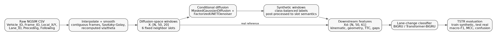
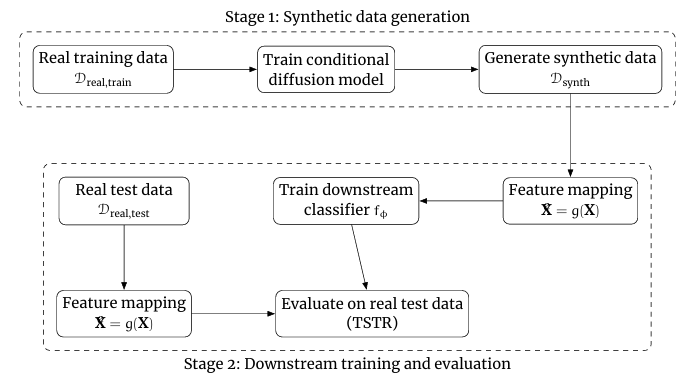
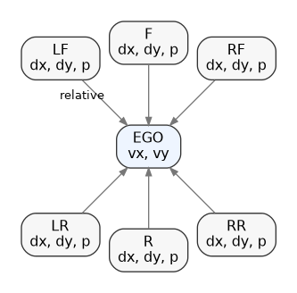
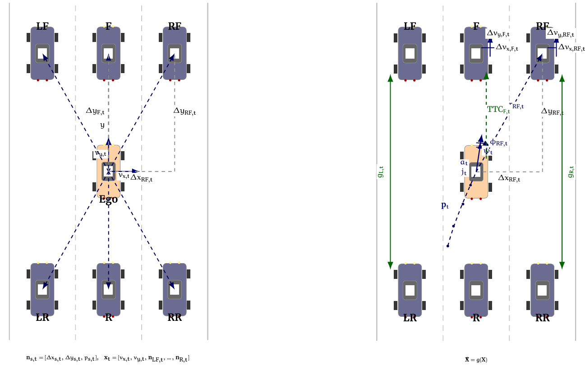
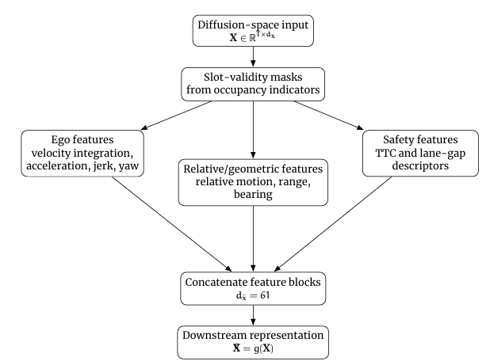
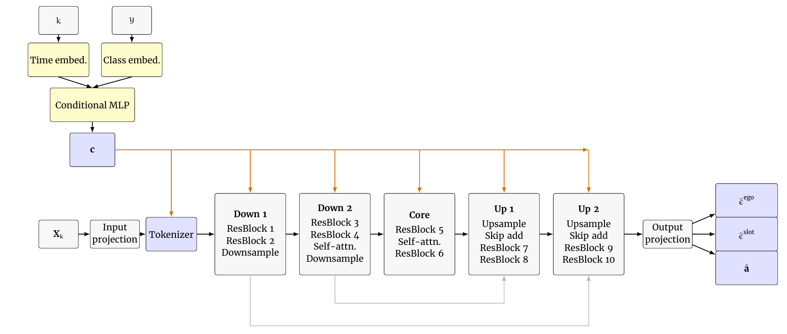
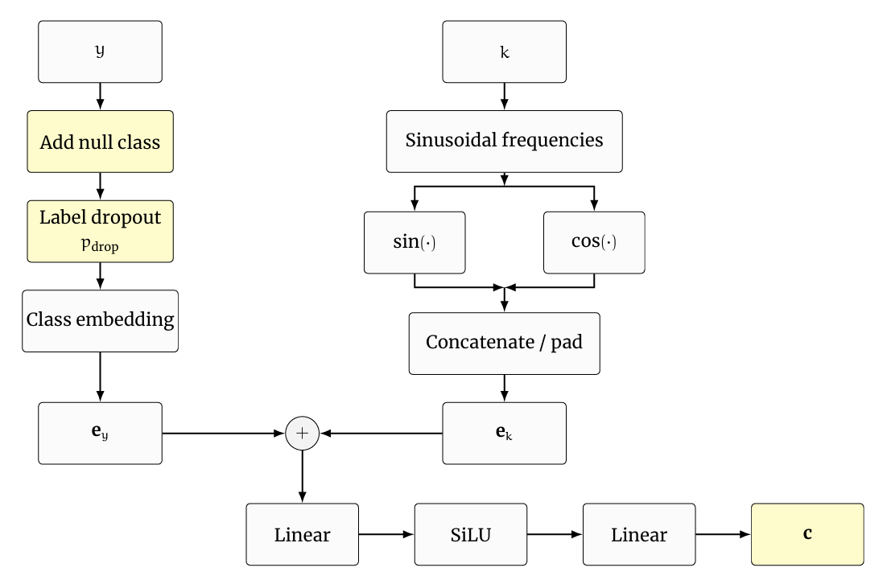
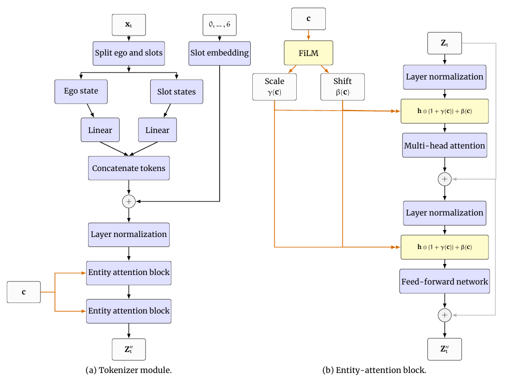
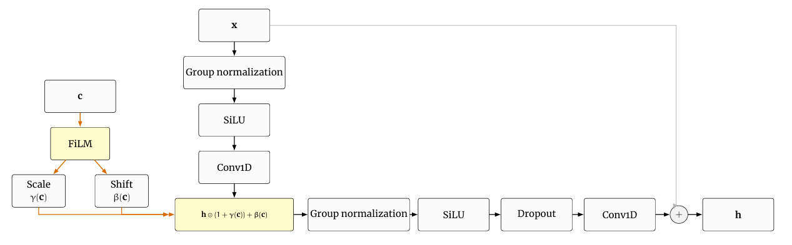
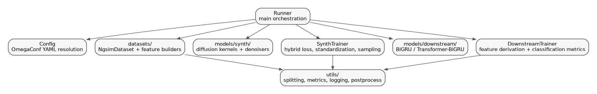

# Entity Aware Conditional Diffusion for Traffic Data Synthesis and Lane-Change Prediction

Research code for **time-series entity-aware conditional diffusion for local traffic-scenario synthesis**, with downstream lane-change prediction under a **Train-on-Synthetic Test-on-Real (TSTR)** protocol.

This repository implements the thesis pipeline from raw microscopic NGSIM trajectories to fixed-slot diffusion sequences, synthetic traffic generation, deterministic downstream feature derivation, and utility-based classifier evaluation. The core research question is whether a **structured conditional diffusion model** can synthesize **local highway traffic sequences** that remain useful for **real-data lane-change prediction**.

The implementation follows the thesis *Time-series Entity-Aware Conditional Diffusion for Traffic Data Synthesis to predict vehicle lane-change* by Mohamed Abdelaziz, with the strongest alignment to:

- **Problem formulation and representations:** Sections **3.1.1–3.1.4**
- **Data and feature engineering:** Sections **3.2.1–3.2.6**
- **Structured conditional diffusion model:** Sections **3.3.1–3.3.5**
- **Downstream TSTR/TRTR evaluation:** Sections **3.4**, **4.2**, **4.5**, **4.7**
- **Main reported results:** Sections **5.1–5.3**

---

## 1) End-to-end overview

The project is organized around a two-stage workflow: first generate synthetic fixed-slot traffic windows in diffusion space, then evaluate them through downstream lane-change prediction in a richer derived feature space.



The higher-level stage view is:



### What the repository does

1. **Preprocess NGSIM trajectories** with interpolation, smoothing, and kinematic recomputation.
2. **Construct fixed-slot local scenarios** centered on an ego vehicle.
3. **Train a class-conditional diffusion model** over the compact diffusion-space representation.
4. **Generate synthetic traffic sequences** and enforce structural consistency.
5. **Map real or synthetic sequences to downstream features**.
6. **Train lane-change classifiers** and evaluate under **TRTR** and **TSTR** protocols.

---

## 2) Thesis alignment

| Repository area | Thesis reference | What is implemented |
|---|---|---|
| `datasets/ngsim/interpolate.py` | Section 3.2.2 | Trajectory regularization, interpolation, Savitzky-Golay smoothing, velocity/acceleration/yaw-proxy recomputation. |
| `datasets/ngsim/diffusion_feature_builder.py` | Sections 3.1.2, 3.1.3, 3.2.3, 3.2.4 | Fixed-slot local traffic scenarios, `T=50`, six neighbor slots, horizon/boundary lane-change labels. |
| `datasets/ngsim/downstream_feature_builder.py` | Sections 3.2.5, 3.2.6 | Deterministic mapping from 20 diffusion features to 61 downstream kinematic, geometric, TTC, and gap features. |
| `models/synth/masked_gaussian_diffusion` | Sections 3.3.1, 3.3.4 | Gaussian forward process, cosine schedule, mixed reverse conversion for occupancy channels, DDPM/DDIM-style sampling. |
| `models/synth/unet_factorized_denoiser` | Section 3.3.2 | Entity-aware conditional denoiser: slot tokenization, frame-level entity self-attention, temporal U-Net, factorized output heads. |
| `trainers/synth.py` | Section 3.3.3 | Hybrid diffusion objective with ego, slot, mask, and temporal consistency losses. |
| `trainers/downstream.py` | Sections 3.4, 4.2, 4.5, 4.7 | TRTR/TSTR downstream evaluation using macro-F1, balanced accuracy, weighted F1, MCC, and confusion matrices. |
| `utils/post_process.py` | Section 3.3.4 | Structural projection: occupancy thresholding, absent-slot zeroing, front/rear sign conventions, plausible-range clipping. |

For a more detailed mapping, see [`docs/THESIS_ALIGNMENT.md`](docs/THESIS_ALIGNMENT.md).

---

## 3) State representation and feature spaces

### 3.1 Fixed-slot diffusion-space representation

Each frame is encoded as ego velocity plus six semantically ordered neighboring slots: **LF, LR, RF, RR, F, R**. Missing neighbors are represented by `(dx=0, dy=0, p=0)`. This corresponds to thesis Sections **3.1.2**, **3.1.3**, and **3.2.3**.



The 20-dimensional diffusion-space feature order is:

```text
[vx, vy,
 LF_dx, LF_dy, LF_p,
 LR_dx, LR_dy, LR_p,
 RF_dx, RF_dy, RF_p,
 RR_dx, RR_dy, RR_p,
 F_dx,  F_dy,  F_p,
 R_dx,  R_dy,  R_p]
```

### 3.2 Diffusion-space vs downstream feature space

The model does **not** directly generate all engineered downstream variables. Instead, it generates the compact traffic state and then applies a deterministic mapping `g(X)` into the downstream feature space, as described in thesis Sections **3.2.5–3.2.6**.



### 3.3 Downstream feature extraction

The downstream representation adds ego kinematics, relative motion, geometry, TTC, and lane-gap descriptors. This is the feature space consumed by the downstream lane-change classifiers.



---

## 4) Detailed denoiser architecture

The final denoiser implements the factorized architecture described in thesis Section **3.3.2**. The main design idea is to separate:

- **frame-level interaction modeling**, where the ego vehicle and neighbor slots interact within a single time step; and
- **temporal denoising**, where the sequence is refined over time by a 1D temporal U-Net.

### 4.1 Top-level denoiser



**Inputs**

- `x_t`: noisy traffic sequence of shape `[B, T, 20]`
- `t`: diffusion step indices of shape `[B]`
- `y`: maneuver labels of shape `[B]` or `None` for null-conditioning / CFG

**Outputs**

| Head | Shape | Meaning |
|---|---:|---|
| `eps_ego` | `[B, T, 2]` | Noise prediction for ego velocity channels. |
| `eps_slots` | `[B, T, 6, 2]` | Noise prediction for continuous slot-geometry channels. |
| `p_logits` | `[B, T, 6]` | Clean occupancy logits for binary slot presence. |

This matches the mixed continuous-binary reverse parameterization described in thesis Sections **3.3.1–3.3.3**.

### 4.2 Conditioning pathway

Conditioning combines the diffusion step embedding and the maneuver-class embedding into a global conditioning vector `c`, which modulates the tokenizer and temporal U-Net through **FiLM**. During training, label dropout enables **classifier-free guidance (CFG)**, consistent with thesis Section **3.3.2**.



Concretely, the denoiser uses:

- a **sinusoidal time-step embedding**,
- a **learned class embedding** for `{lane-keeping, right-LC, left-LC}`,
- a **null label** for CFG,
- a **conditioning MLP** to produce the global vector `c`, and
- **FiLM scale-and-shift modulation** inside attention and residual blocks.

### 4.3 Tokenization and frame-level entity attention

Each frame is decomposed into one **ego token** and six **slot tokens**. Ego and slot states are projected separately into a shared token dimension, slot embeddings preserve slot identity, and entity attention models interactions among the seven entities within the same physical frame.



This is the part of the architecture that makes the model **entity-aware** rather than treating the 20 channels as an exchangeable flat vector.

### 4.4 Temporal residual block

After entity attention, the tokenized frame representation is flattened along the entity axis and processed as a temporal signal by a 1D U-Net. The core residual block uses GroupNorm, SiLU, FiLM conditioning, dropout, and a residual skip path.



### 4.5 Repository component map

The following diagram summarizes how the main repository modules fit together.



---

## 5) Main thesis results

The README includes the main thesis-reported results so that readers can quickly assess downstream utility and distributional fidelity without opening the thesis first. These values correspond to thesis Sections **5.1–5.3**.

### 5.1 TSTR downstream evaluation (thesis Table 5.1)

| Generative model | Accuracy ↑ | Macro-F1 ↑ | MCC ↑ |
|---|---:|---:|---:|
| TRTR reference | 80.56 | 80.41 | 70.63 |
| Random-noise augmentation | 31.21 | 33.47 | 10.53 |
| Unconditional temporal U-Net | 43.62 | 47.18 | 31.22 |
| Vanilla Transformer (Uncond.) | 45.84 | 42.78 | 21.77 |
| DATG [51] | 67.49 | 67.40 | 51.71 |
| DATG [51] + Entity Attention | 74.28 | 74.01 | 61.67 |
| **Proposed model** | **78.41** | **78.53** | **67.77** |

**Reading the table:**

- The proposed model achieves **78.53 macro-F1** in the **TSTR** setting.
- The **TRTR** reference is **80.41 macro-F1**.
- The remaining gap is **1.88 points**, which is the main thesis result.
- The proposed model outperforms **DATG** by **11.13 macro-F1 points** and **DATG + Entity Attention** by **4.52 points**.

### 5.2 Distributional agreement (thesis Table 5.2)

| Variable | Norm. Wass. ↓ | KS ↓ | Variable | Norm. Wass. ↓ | KS ↓ |
|---|---:|---:|---|---:|---:|
| `vx` | 0.10 | 0.0647 | `ΔxRR` | 0.36 | 0.1473 |
| `vy` | 0.17 | 0.0624 | `ΔyRR` | 0.12 | 0.0624 |
| `ΔxLF` | 0.28 | 0.1126 | `pRR` | 0.05 | 0.0117 |
| `ΔyLF` | 0.08 | 0.0814 | `ΔxF` | 0.31 | 0.0984 |
| `pLF` | 0.11 | 0.0286 | `ΔyF` | 0.36 | 0.1095 |
| `ΔxLR` | 0.29 | 0.1081 | `pF` | 0.51 | 0.1849 |
| `ΔyLR` | 0.17 | 0.0433 | `ΔxR` | 0.29 | 0.0911 |
| `pLR` | 0.05 | 0.0152 | `ΔyR` | 0.34 | 0.1083 |
| `ΔxRF` | 0.38 | 0.1495 | `pR` | 0.49 | 0.1781 |
| `ΔyRF` | 0.01 | 0.0710 | **Median** | **0.225** | **0.0863** |
| `pRF` | 0.06 | 0.0174 | **Mean** | **0.2265** | **0.0873** |

**Reading the table:**

- Most diffusion-space channels show good agreement between real and synthetic data.
- The largest discrepancies occur in sparse occupancy-related channels, especially `pF` and `pR`, which is also discussed in thesis Section **6.2**.
- Distributional matching is treated as a **supporting diagnostic**, while **TSTR utility** is the primary evaluation criterion.

---

## 6) Repository layout

```text
.
├── config.yaml                         # Single source of runtime configuration
├── main.py                             # Entrypoint
├── runner.py                           # End-to-end orchestration
├── datasets/
│   ├── base.py                         # Dataset cache/load/save abstraction
│   └── ngsim/                          # NGSIM cleaning, windowing, feature builders
├── models/
│   ├── common/                         # FiLM, attention, residual blocks, embeddings
│   ├── synth/                          # Diffusion kernels and denoisers
│   └── downstream/                     # Sequence classifiers
├── trainers/
│   ├── base.py                         # Splits, loaders, optimizer, scheduler, checkpointing
│   ├── synth.py                        # Diffusion training and synthetic generation
│   └── downstream.py                   # Classifier training and TSTR/TRTR evaluation
├── utils/                              # Metrics, standardizers, logging, post-processing
├── datasets-files/                     # Runtime data cache root; raw data is not committed
└── docs/                               # Research and engineering documentation
```

Directory-specific explanations are available in:

- [`datasets/README.md`](datasets/README.md)
- [`models/README.md`](models/README.md)
- [`models/synth/README.md`](models/synth/README.md)
- [`models/downstream/README.md`](models/downstream/README.md)
- [`trainers/README.md`](trainers/README.md)
- [`utils/README.md`](utils/README.md)
- [`datasets-files/README.md`](datasets-files/README.md)

---

## 7) Data contract

The code expects the raw NGSIM CSV at:

```text
datasets-files/raw/ngsim.csv
```

The selected raw columns are configured in `config.yaml`:

```yaml
Vehicle_ID, Frame_ID, Local_X, Local_Y, Lane_ID, Preceding, Following
```

The thesis uses the NGSIM I-80 subset, a sampling interval of `0.1 s`, observation windows of `50` frames, a future horizon of `30` frames, stride `30`, and boundary-based lane-change labels with `theta_start = theta_end = 0.02` and `consec = 3`.

Large raw datasets, generated `.npz` caches, model checkpoints, logs, and W&B artifacts should not be committed. See [`datasets-files/README.md`](datasets-files/README.md) and [`.gitignore`](.gitignore).

---

## 8) Installation

### 1. Create an environment

```bash
python -m venv .venv
source .venv/bin/activate
python -m pip install --upgrade pip
python -m pip install -r requirements.txt
```

For GPU training, install the PyTorch build matching your CUDA version before installing the remaining requirements.

### 2. Place the dataset

```bash
mkdir -p datasets-files/raw
cp /path/to/ngsim.csv datasets-files/raw/ngsim.csv
```

### 3. Configure the run

Edit `config.yaml`. The default run uses:

```yaml
runner:
  model:
    diffusion: MaskedGaussianDiffusion
    synth: FactorizedUNETDenoiser
    downstream: BiGRUClassifier
  train:
    synth: true
    downstream: true
```

The repository configuration is the executable source of truth. The thesis reports a final diffusion setup in Section **4.3**; if a published experiment must be reproduced exactly, confirm that the runtime values in `config.yaml` match that table before training.

---

## 9) Common workflows

### Train the diffusion model and generate synthetic data

```bash
python main.py
```

With the default configuration, this performs:

1. Raw NGSIM loading and refactored cache creation if missing.
2. Diffusion standardization on the train split.
3. Synthetic model training.
4. Synthetic sequence generation.
5. Inverse standardization and structural post-processing.
6. Synthetic cache writing to `datasets-files/synth/`.
7. Downstream classifier training and real-data evaluation.

### Generate from an existing checkpoint only

Set:

```yaml
runner:
  train:
    synth: true
    synth_generate_only: true
    downstream: false
trainers:
  diffSynth:
    checkpoint:
      autoload_for_sampling: true
      autoload_tag: best
```

Then run:

```bash
python main.py
```

### Train downstream evaluation only

Set:

```yaml
runner:
  train:
    synth: false
    downstream: true
```

If a synthetic cache exists, the downstream trainer uses the synthetic cache as training data and evaluates on raw/refactored real data when the train and test dataset names match. If no synthetic cache exists, `BaseDataset` falls back to the refactored real dataset, producing a TRTR-style run.

---

## 10) Output artifacts

| Output | Location | Notes |
|---|---|---|
| Clean raw CSV | `datasets-files/raw/ngsim-clean.csv` | Created after column selection, numeric conversion, filtering, and sorting. |
| Interpolated CSV | `datasets-files/raw/ngsim-interpolated-clean.csv` | Created after interpolation, smoothing, and kinematic recomputation. |
| Refactored real metadata | `datasets-files/refactored/ngsim.csv` | Window-level metadata: `Vehicle_ID`, `End_Frame_ID`, `y`. |
| Refactored real arrays | `datasets-files/refactored/ngsim.npz` | Contains `X: [N,50,20]`, `y: [N]`. |
| Diffusion standardizer | `datasets-files/refactored/ngsim.std.npz` | Feature-wise `mu`, `sigma` for diffusion-space data. |
| Synthetic metadata | `datasets-files/synth/ngsim-N*.csv` | Generated windows and labels. |
| Synthetic arrays | `datasets-files/synth/ngsim-N*.npz` | Generated `X: [N,50,20]`, `y: [N]`. |
| Downstream standardizer | `datasets-files/synth/ngsim.derived.std.npz` | Feature-wise stats for `Xd: [N,50,61]`. |
| Checkpoints | `models-checkpoints/` | Trainer-dependent checkpoint paths. |
| Logs | `logs/` | Local logger output. |

---

## 11) Evaluation protocol

The key evaluation is **TSTR**:

1. Train the diffusion model on real traffic windows.
2. Generate class-balanced synthetic windows.
3. Derive downstream features from synthetic windows.
4. Train the downstream lane-change classifier on synthetic data.
5. Evaluate on real NGSIM-derived windows.

The main scalar metric is **macro-F1**, because all three maneuver classes should contribute equally. The trainer also logs accuracy, balanced accuracy, weighted F1, and MCC.

The README tables above are **thesis-reported results**. Treat them as reference values, not automatic outcomes from a fresh run unless the same data subset, preprocessing, configuration, and checkpoint-selection procedure are used.

---

## 12) Reproducibility notes

- `runner.seed` controls NumPy/PyTorch seeding through `utils/seeder.py`.
- Dataset splits can be group-wise by `Vehicle_ID`, preventing windows from the same vehicle from crossing train/validation/test boundaries.
- Standardizers are fit on training indices only, then applied to validation/test or synthetic/real evaluation data as appropriate.
- Synthetic generation is chunked to avoid GPU memory overflow.
- Structural post-processing is deterministic and should be considered part of the generative pipeline.
